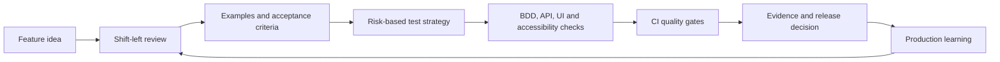

# QA Engineering Portfolio - Oliver Kelly

A practical, traceable quality engineering portfolio showing how I move from an ambiguous idea to a release decision. It combines senior-level QA thinking with runnable UI, API, BDD and accessibility checks against one self-contained application.

The examples are deliberately connected. The feature ticket defines the outcome; the risk assessment shapes coverage; Gherkin captures shared behaviour; each automation layer has a reason to exist; CI turns the checks into repeatable evidence.

## Two-minute tour

| If you want to assess... | Start here | Evidence |
|---|---|---|
| Senior QA judgement | [Test strategy](docs/test-strategy.md) | Risk model, scope, release criteria and residual risk |
| Shift-left capability | [Feature ticket](docs/examples/feature-ticket.md) | Questions, assumptions, examples and testable acceptance criteria |
| BDD and Gherkin | [Guest checkout feature](tests/bdd/features/guest-checkout.feature) | Business-readable scenarios with Cucumber execution |
| Playwright and Page Objects | [Checkout specification](tests/playwright/checkout.spec.js) | Intent-focused UI checks, fixtures and failure evidence |
| API testing | [Order API specification](tests/playwright/api/orders.api.spec.js) | Positive, boundary and error-contract coverage |
| Cypress | [Cypress checkout tests](tests/cypress/e2e/checkout.cy.js) | UI-to-network assertions and controlled failure simulation |
| Selenium and Page Factory | [Java checkout test](tests/selenium-java/src/test/java/uk/co/olikelly/qa/tests/GuestCheckoutTest.java) | Explicit waits, Page Factory and readable test intent |
| Accessibility | [Automated accessibility check](tests/playwright/accessibility/checkout.a11y.spec.js) | WCAG A/AA axe scan, positioned as one part of accessibility testing |
| Defect quality | [Example defect](docs/examples/defect-report.md) | Reproducibility, impact, evidence, environment and investigation notes |
| Automation judgement | [Automation decision framework](docs/automation-decision-framework.md) | Value/cost model and examples of what should remain manual |
| CI/CD and release thinking | [Quality gates](docs/ci-cd-quality-gates.md) | Fast feedback, deeper checks, evidence and exception handling |

## Quality story



Traceability is maintained in [the coverage matrix](docs/traceability-matrix.md). The aim is not the maximum number of tests; it is the smallest maintainable set that gives the team useful confidence at the right time.

## What is runnable

The repository includes a small local checkout system with no external services or test accounts. This keeps the results deterministic and lets the examples focus on testing technique.

Prerequisites: Node.js 20+ and npm. Java 21 and Maven are only needed for the Selenium example.

```bash
npm install
npx playwright install chromium
npm test
```

Additional suites:

```bash
npm run test:cypress
npm run test:playwright -- --grep @smoke

# With the demo app running in another terminal:
cd tests/selenium-java
mvn test
```

Playwright produces an HTML report with traces, screenshots and video retained on failure. Cucumber writes `test-results/cucumber-report.html`. Cypress captures screenshots on failure. CI uploads these as build artefacts so a failed check is diagnosable rather than merely red.

## Repository map

```text
.
|-- .github/workflows/qa.yml       # Pull-request and main-branch quality gates
|-- demo-app/                      # Self-contained system under test
|-- docs/
|   |-- examples/                  # Feature ticket, defect and exploratory charter
|   |-- test-strategy.md           # Risk-based scope and release approach
|   |-- traceability-matrix.md     # Requirement-to-evidence mapping
|   |-- automation-decision-framework.md
|   `-- ci-cd-quality-gates.md
`-- tests/
    |-- bdd/                       # Gherkin + Cucumber + Playwright
    |-- playwright/                # UI, API and accessibility coverage
    |-- cypress/                   # Alternative UI/network approach
    `-- selenium-java/             # Page Factory example
```

## Engineering principles demonstrated

- Shift quality left by challenging ambiguity before code exists.
- Test according to product risk, not a fixed test-script quota.
- Put most deterministic business-rule coverage below the UI.
- Use Gherkin for shared examples, not as a wrapper around every test.
- Keep selectors and browser mechanics behind page abstractions where that improves readability.
- Treat accessibility, observability and operability as product quality.
- Design failure evidence for the person who must diagnose it.
- Make release decisions explicit, including residual risk and exceptions.
- Learn from production signals and feed them back into discovery and regression coverage.

## Portfolio boundaries

This is a focused demonstration, not a production commerce platform. Payment, authentication, persistence, security scanning, contract-provider infrastructure and real monitoring are out of scope. The documents explain where those concerns would enter a real delivery plan. All names and data are synthetic; no employer code, tickets or confidential information are included.

## About me

I am a Senior QA Engineer and hands-on QA Lead with 8+ years across SaaS, enterprise and public-sector systems. My work spans exploratory and risk-based testing, API/OpenAPI quality, release readiness, automation support, accessibility, process improvement and AI-assisted QA tooling. Connect with me on [LinkedIn](https://www.linkedin.com/in/oli-kelly/).

Licensed under the [MIT License](LICENSE).
