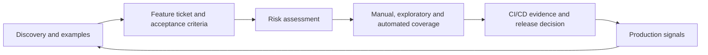

# QA practitioner guides

These guides explain how I apply quality engineering techniques, including where they help, where they are commonly misused and how I decide what “good” looks like. They are opinionated working notes rather than tool documentation.

## Suggested reading path

| Guide | What it demonstrates |
|---|---|
| [BDD, Gherkin and Cucumber](bdd-gherkin-and-cucumber.md) | Collaborative discovery, executable examples and maintainable step design |
| [Feature tickets and acceptance criteria](feature-tickets-and-acceptance-criteria.md) | Turning an idea into shared, testable behaviour without writing a mini-specification |
| [Risk-based testing](risk-based-testing.md) | Matching depth and technique to likelihood, impact and uncertainty |
| [Choosing what to automate](choosing-what-to-automate.md) | Selecting valuable checks and the lowest effective layer |
| [UI automation architecture](ui-automation-architecture.md) | Page Objects, Page Factory, selectors, waits, data and failure diagnosis |
| [Playwright, Cypress, Selenium and Cucumber](automation-tools.md) | Choosing tools by context rather than popularity |
| [Writing effective defects](writing-effective-defects.md) | Communicating impact and reproducible evidence without guessing the cause |
| [Shift-left, CI/CD and shift-right](quality-across-delivery.md) | Building quality into discovery, delivery, release and production learning |

## How the guides connect to evidence

The worked example throughout is the repository’s promotional guest checkout. Start with the [feature ticket](../examples/feature-ticket.md), compare it with the [risk-based test strategy](../test-strategy.md), then follow the requirement-to-test links in the [traceability matrix](../traceability-matrix.md).

## A note on terminology

I use **test** for an activity that evaluates a product and **automated check** for a programmed comparison. The distinction matters: automation can confirm known expectations quickly, while testing also involves learning, modelling, questioning and judgement.
